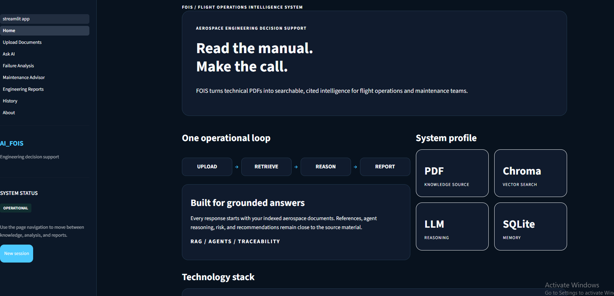
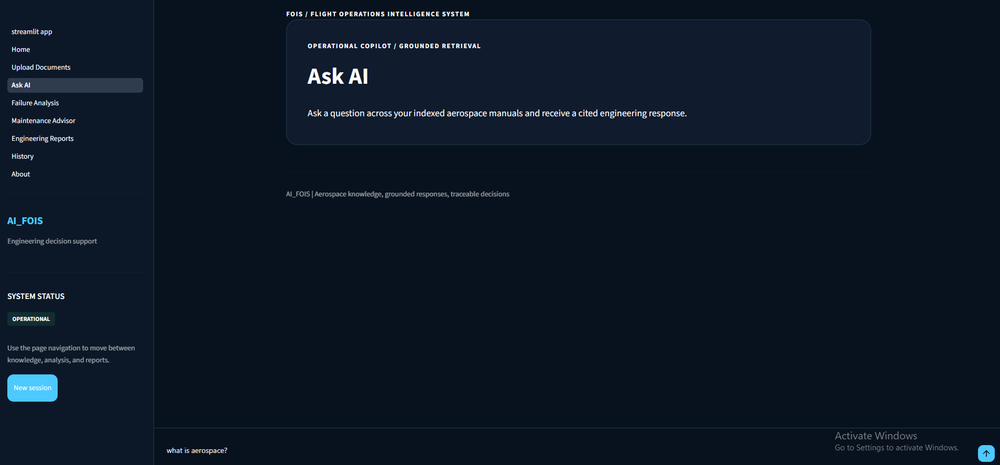
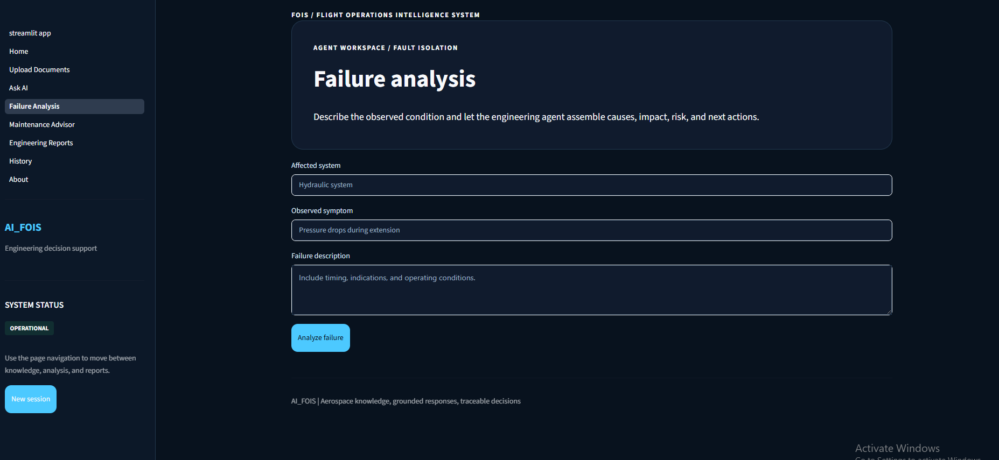
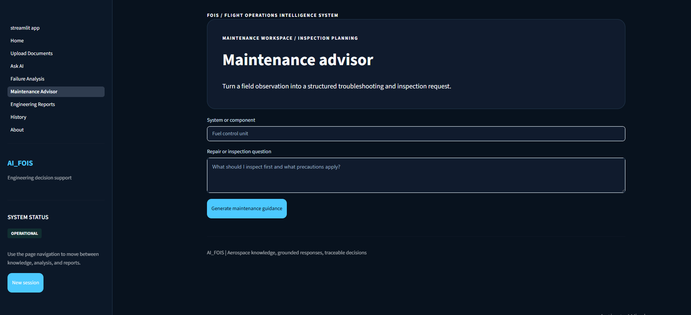
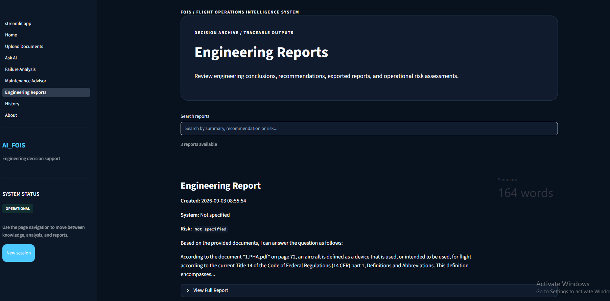
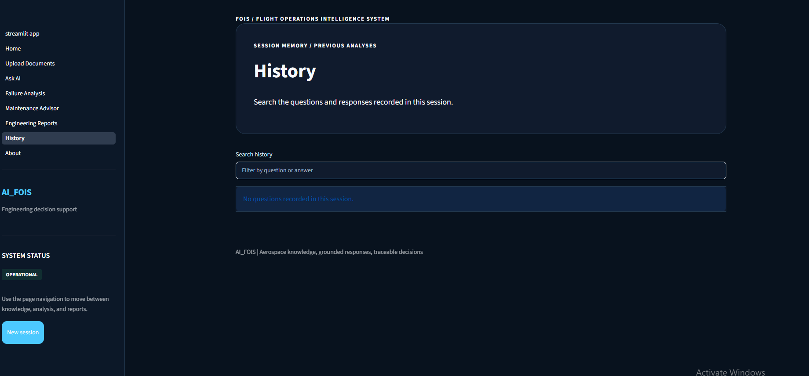
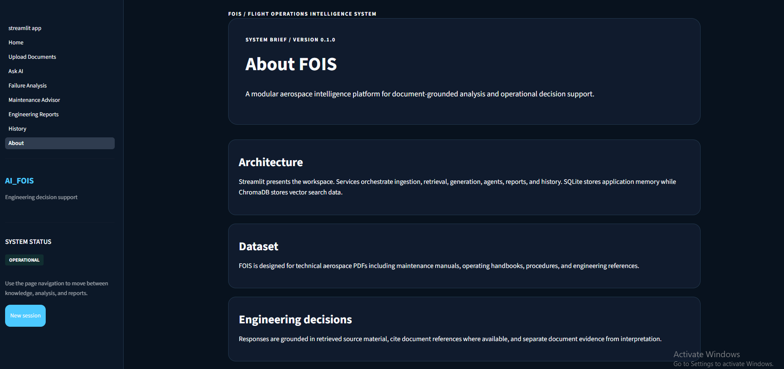

# AI Flight Operations Intelligence System

## Project Report

---

# 1. Abstract

The AI Flight Operations Intelligence System (AI-FOIS) is an aerospace-focused Generative Artificial Intelligence application designed to assist maintenance engineers in retrieving, analyzing, and reasoning over technical aviation documentation. Modern aircraft maintenance relies on thousands of pages of manuals, handbooks, and engineering references, making the process of locating accurate information both time-consuming and cognitively demanding.

Traditional keyword-based document search provides limited contextual understanding and cannot reason about aircraft systems, maintenance procedures, failure propagation, or operational consequences. To address these limitations, this project combines Retrieval-Augmented Generation (RAG), semantic search, Large Language Models (LLMs), AI agents, and tool-calling to build an intelligent maintenance assistant capable of generating grounded engineering responses from aerospace documentation.

Rather than functioning as a simple question-answering chatbot, AI-FOIS follows an engineering-oriented reasoning pipeline. User queries are transformed into semantic embeddings, relevant document sections are retrieved from a vector database, and a locally hosted language model synthesizes responses using only the retrieved context. The generated response is then enhanced through a collection of specialized engineering tools responsible for failure classification, risk assessment, maintenance recommendations, system dependency analysis, troubleshooting, and engineering report generation.

The project demonstrates the integration of modern Generative AI techniques with software engineering principles to create a modular, maintainable, and extensible aerospace decision-support system. Beyond implementing Retrieval-Augmented Generation, this work explores how an orchestrating agent and specialized Python tools can transform static aviation manuals into an interactive engineering knowledge system capable of supporting aircraft maintenance workflows.


# 2. Introduction

Modern aircraft are complex engineering systems consisting of thousands of interconnected mechanical, electrical, hydraulic, avionics, and software components. To maintain these systems safely and efficiently, maintenance engineers rely on extensive technical documentation such as aircraft maintenance manuals, pilot operating handbooks, system descriptions, troubleshooting guides, and regulatory publications.

Locating the correct information within these documents is often a time-consuming task. Traditional keyword-based search methods require engineers to manually navigate hundreds or even thousands of pages, making it difficult to quickly identify procedures, understand system relationships, or analyze complex maintenance scenarios. While experienced engineers develop familiarity with these documents over time, accessing the right information efficiently remains a significant challenge.

Recent advances in Generative Artificial Intelligence have introduced new approaches for interacting with technical knowledge. Large Language Models (LLMs) are capable of understanding natural language queries and generating human-like responses. However, these models possess limited domain knowledge and may produce inaccurate or hallucinated information when answering highly specialized aerospace questions without reliable supporting context.

Retrieval-Augmented Generation (RAG) addresses this limitation by combining semantic document retrieval with language generation. Instead of relying solely on the model's internal knowledge, relevant sections of aircraft documentation are retrieved from a vector database and supplied as contextual information before generating a response. This approach enables the system to produce grounded, context-aware answers while significantly reducing hallucinations.

Building upon RAG, modern AI systems can further enhance reasoning through specialized tools and orchestration. Rather than generating a single textual response, Python tools perform individual engineering tasks such as failure classification, risk assessment, maintenance recommendation, troubleshooting guidance, system dependency analysis, flight impact evaluation, and structured report generation. These tools are coordinated sequentially by the Aerospace Agent.

The objective of the Flight Operations Intelligent System (FOIS) is not to replace aircraft maintenance engineers or certified aviation personnel. Instead, it is designed as an intelligent decision-support system that assists users in retrieving relevant technical information, analyzing engineering problems, and organizing maintenance knowledge into clear, structured responses. The system combines document retrieval, grounded language generation, AI agents, and engineering tool pipelines to create an integrated aerospace knowledge assistant capable of supporting maintenance-related decision making.

Beyond its practical application, this project also serves as a comprehensive learning exercise in Generative AI and Software Engineering. It provides hands-on experience with Retrieval-Augmented Generation, vector databases, embedding models, local Large Language Models, prompt engineering, AI agents, tool calling, document processing pipelines, and modular application architecture while demonstrating how these technologies can be integrated into a production-style aerospace AI system.

# 3. Problem Statement

Aircraft maintenance engineers work with thousands of pages of technical documentation, including maintenance manuals, system descriptions, troubleshooting procedures, service bulletins, and engineering references. Locating the correct information during maintenance activities often requires manually searching across multiple documents, interpreting technical terminology, and connecting information from different sources.

Traditional keyword-based document search systems rely on exact word matching and are unable to understand the semantic meaning of engineering queries. As a result, engineers may spend significant time locating relevant procedures, understanding system relationships, or identifying possible causes of failures. These limitations can reduce efficiency and increase the complexity of maintenance decision-making.

Recent advancements in Large Language Models (LLMs) have introduced new possibilities for intelligent question answering. However, standalone LLMs may generate inaccurate or hallucinated responses when asked about highly specialized aerospace knowledge, making them unsuitable for safety-critical engineering applications without access to reliable reference material.

To address these challenges, this project proposes an AI-powered Flight Operations Information System (FOIS) that combines Retrieval-Augmented Generation (RAG), semantic search, vector databases, local Large Language Models, AI agents, and tool-calling capabilities. Instead of relying solely on the knowledge stored within an LLM, the system retrieves relevant information from aerospace documents, grounds responses using retrieved context, and employs specialized engineering tools to perform structured reasoning and analysis.

The system is designed to function as an intelligent decision-support assistant rather than replacing aircraft maintenance engineers. Its objective is to help users efficiently retrieve relevant technical information, analyze maintenance scenarios, generate structured engineering insights, and support informed maintenance decisions while ensuring that responses remain grounded in authoritative aerospace documentation.

> **Problem Statement:**  
> Aircraft maintenance engineers often spend significant time locating relevant technical procedures across large aerospace manuals. Conventional keyword-based search systems cannot effectively understand engineering context, system relationships, or maintenance workflows, while standalone language models may produce unreliable responses due to hallucinations. The objective of this project is to develop an intelligent aerospace assistant capable of retrieving, analyzing, and reasoning over technical aviation documentation using Retrieval-Augmented Generation, AI agents, and tool-calling mechanisms to provide accurate, context-aware engineering decision support.

# 4. Objectives

The primary objective of this project was to design and develop an intelligent aerospace knowledge assistant capable of retrieving, analyzing, and reasoning over technical aviation documentation using modern Generative Artificial Intelligence techniques.

Unlike traditional document search systems, the proposed system combines Retrieval-Augmented Generation (RAG), semantic search, local Large Language Models, AI agents, and tool-calling mechanisms to provide context-aware engineering assistance while maintaining responses grounded in aerospace reference materials.

The specific objectives of the project are described below.

---

## 4.1 AI Objectives

- Develop a Retrieval-Augmented Generation (RAG) system for aerospace documentation.

- Generate context-aware responses using retrieved engineering knowledge.

- Reduce hallucinations by grounding language model responses in reference documents.

- Implement semantic search using embedding models and vector databases.

- Deploy a locally hosted Large Language Model for offline inference.

- Integrate AI agents and tool-calling to perform structured engineering reasoning.

---

## 4.2 Aerospace Objectives

- Retrieve relevant information from aerospace technical documentation.

- Analyze aircraft maintenance and operational scenarios.

- Classify aircraft failures based on engineering descriptions.

- Identify possible root causes of reported failures.

- Recommend maintenance inspections and corrective actions.

- Assess operational risks and potential flight impacts.

- Support engineers with structured troubleshooting guidance.

---

## 4.3 Software Engineering Objectives

- Design a modular and maintainable software architecture.

- Separate document ingestion, retrieval, generation, and reasoning into independent components.

- Develop reusable engineering tools with clearly defined responsibilities.

- Implement an extensible AI agent pipeline capable of supporting additional engineering tools.

- Build an interactive Streamlit application for user interaction.

---

## 4.4 Learning Objectives

This project was also developed as a practical learning exercise to understand the technologies involved in building modern Generative AI applications.

The primary learning objectives included:

- Retrieval-Augmented Generation (RAG)

- Vector Databases

- Embedding Models

- Local Large Language Model Inference

- Prompt Engineering

- Semantic Search

- AI Agents

- Tool Calling

- Aerospace Documentation Processing

- Modular Software Engineering

# 5. Dataset Description

## 5.1 Document Sources

Unlike traditional Machine Learning projects that rely on structured datasets, the AI Flight Operations Intelligence System (AI-FOIS) was developed using a collection of aerospace reference documents. These documents serve as the system's knowledge base and provide the technical information required for retrieval, reasoning, and engineering analysis.

The knowledge base consists of authoritative aerospace textbooks covering aircraft operations, aerodynamics, flight principles, and aircraft systems. These documents were selected to provide broad coverage of aviation concepts while supporting maintenance-related question answering and engineering reasoning.

The documents used in this project include:

| Document | Domain |
|----------|--------|
| Pilot's Handbook of Aeronautical Knowledge (PHAK) | Flight Operations |
| Introduction to Flight (8th Edition) | Flight Principles |
| Fundamentals of Aerodynamics (5th Edition) | Aerodynamics |
| Aircraft Systems – Ian Moir & Allan Seabridge | Aircraft Systems & Maintenance |

The repository also currently contains `Basic Python.pdf` in `data/documents/`. It is not an aerospace reference and should be removed or explicitly treated as a supplementary document before production deployment.

These documents collectively provide information related to aircraft structures, hydraulic systems, electrical systems, flight controls, aerodynamics, aircraft performance, maintenance procedures, and operational principles.

---

## 5.2 Knowledge Base Overview

Rather than training a model directly on aerospace documentation, the documents were transformed into a searchable knowledge base using a Retrieval-Augmented Generation (RAG) pipeline.

The processing pipeline converts unstructured PDF documents into semantic representations that can be efficiently retrieved during user queries.

The knowledge base consists of:

- Multiple aerospace reference documents
- Extracted engineering text
- Semantic document chunks
- Vector embeddings
- Metadata describing document sources
- Persistent vector database storage

Unlike static keyword search, this approach enables semantic retrieval based on the meaning of a user's question rather than exact word matching.

---

## 5.3 Document Processing

Before documents could be used by the AI system, they were processed through several stages to convert raw PDF files into machine-readable semantic knowledge.

The document processing workflow consists of:

```text
PDF Documents
      │
      ▼
Text Extraction
      │
      ▼
Document Cleaning
      │
      ▼
Text Chunking
      │
      ▼
Embedding Generation
      │
      ▼
Vector Database
```

Each stage prepares the documents for efficient semantic retrieval while preserving the technical context contained within the original aerospace references.

---

## 5.4 Document Chunking

Large Language Models have limited context windows and cannot efficiently process entire textbooks simultaneously. To address this limitation, each document was divided into smaller overlapping text segments called **chunks**.

Chunking provides several advantages:

- Improves retrieval accuracy
- Preserves local engineering context
- Reduces retrieval latency
- Enables efficient semantic indexing

An overlapping chunking strategy was used to ensure that important technical information spanning multiple paragraphs was not separated during processing.

Each chunk maintains:

- Source document
- Page reference
- Chunk identifier
- Chunk text

This metadata enables retrieved responses to remain traceable to their original aerospace documentation.

---

## 5.5 Embedding Generation

Each document chunk was converted into a high-dimensional numerical representation known as an **embedding**.

Embeddings capture the semantic meaning of engineering text, allowing similar concepts to be retrieved even when different terminology is used.

For example, queries related to hydraulic pressure loss can retrieve relevant sections discussing hydraulic failures, pressure regulation, or actuator behavior without requiring identical keywords.

The generated embeddings form the foundation of the semantic retrieval system used throughout the application.

---

## 5.6 Vector Database Construction

After embedding generation, all document vectors were stored in a persistent **Chroma Vector Database**.

The vector database stores:

- Document embeddings
- Chunk text
- Document metadata
- Source references

During user interaction, semantic similarity search is performed against this database to retrieve the most relevant engineering information.

Unlike traditional databases that search using exact values, the vector database retrieves information based on semantic similarity between the user's query and stored document embeddings.

---

## 5.7 Dataset Challenges

Several challenges were encountered while preparing the aerospace knowledge base.

### Unstructured Documents

Unlike tabular datasets, aerospace manuals contain paragraphs, diagrams, tables, equations, and technical terminology, requiring additional preprocessing before semantic indexing.

---

### Context Preservation

Engineering concepts frequently span multiple pages or sections. Chunk overlap was introduced to preserve contextual continuity between adjacent document segments.

---

### Technical Terminology

Aircraft documentation contains specialized aerospace terminology, abbreviations, and domain-specific language. The embedding model needed to preserve semantic relationships between these technical concepts during vector generation.

---

### Retrieval Quality

Selecting appropriate chunk sizes and retrieval parameters required balancing retrieval precision with contextual completeness to ensure that relevant engineering information could be accurately retrieved for downstream language model generation.

# 6. Project Workflow and Methodology

The AI Flight Operations Intelligence System was developed using a structured Generative AI workflow. Rather than treating the application as a simple question-answering chatbot, the project was designed as an end-to-end intelligent aerospace assistant capable of processing technical documents, retrieving relevant engineering knowledge, reasoning over maintenance scenarios, and generating structured engineering reports.

The complete workflow consists of multiple interconnected stages, where each stage is responsible for a specific task within the Retrieval-Augmented Generation (RAG) pipeline. This modular approach improves maintainability, scalability, and allows individual components to be developed, tested, and enhanced independently.

The complete workflow consists of:

1. Document Collection
2. Document Loading
3. Text Extraction
4. Document Chunking
5. Embedding Generation
6. Vector Database Construction
7. Semantic Retrieval
8. Prompt Engineering
9. Large Language Model Generation
10. Tool Calling
11. Engineering Report Generation

---

# 6.1 Overall Workflow

The complete system workflow is:

```text
PDF Documents
      │
      ▼
Document Loading
      │
      ▼
Text Extraction
      │
      ▼
Document Chunking
      │
      ▼
Embedding Generation
      │
      ▼
Vector Database
      │
      ▼
User Query
      │
      ▼
Semantic Retrieval
      │
      ▼
Prompt Construction
      │
      ▼
Large Language Model
      │
      ▼
Tool Calling Pipeline
      │
      ▼
Engineering Report Generation
```

Unlike traditional Machine Learning pipelines that transform datasets into predictive models, this workflow transforms aerospace reference documents into an intelligent engineering knowledge system. Every stage contributes to enabling the assistant to retrieve accurate information, perform structured reasoning, and generate context-aware responses grounded in aerospace documentation.

# 6.2 Document Collection

The first stage of the AI Flight Operations Intelligence System involved collecting authoritative aerospace reference documents that would serve as the system's external knowledge base. Unlike traditional Machine Learning projects that require structured datasets, this project relies on technical engineering documents containing domain-specific knowledge related to aircraft operations, aerodynamics, maintenance, and aircraft systems.

The selected documents were chosen to provide broad coverage of fundamental aerospace concepts while supporting engineering-oriented question answering and maintenance reasoning.

The knowledge base includes documents covering:

- Flight operations
- Aircraft systems
- Aerodynamics
- Aircraft performance
- Engineering principles
- Maintenance concepts

These reference materials form the foundation of the Retrieval-Augmented Generation (RAG) pipeline and provide the contextual knowledge used during response generation.

---

# 6.3 Document Loading

After collecting the aerospace reference documents, the next stage involved loading each document into the processing pipeline.

The document loading component is responsible for:

- Reading PDF documents
- Extracting document metadata
- Preparing files for text extraction
- Passing document contents to the ingestion pipeline

Only supported document formats are processed, ensuring consistency throughout the knowledge base construction process.

This stage serves as the entry point for the entire document ingestion workflow and provides a standardized interface for processing multiple aerospace references.

---

# 6.4 Text Extraction

Once the documents are loaded, textual content is extracted from each PDF.

The objective of this stage is to convert unstructured engineering documents into machine-readable text while preserving the technical information contained within the original manuals and reference books.

The extracted text includes:

- Headings
- Paragraphs
- Technical explanations
- Procedures
- Engineering terminology

The extracted content is then forwarded to the chunking stage for further processing.

Unlike conventional document viewers, this stage transforms static aerospace literature into structured textual data that can be indexed and searched semantically by the AI system.

# 6.5 Document Chunking

After text extraction, the documents are divided into smaller segments known as **chunks**. Since Large Language Models have a limited context window, processing entire aerospace textbooks as a single input is neither efficient nor practical. Chunking enables the system to retrieve only the most relevant sections of documentation for a given user query.

Each document is divided into manageable text segments while preserving the logical flow of technical information. An overlapping chunking strategy is employed to maintain contextual continuity between adjacent chunks, ensuring that engineering concepts spanning multiple paragraphs are not fragmented during retrieval.

The chunking stage provides several benefits:

- Improves semantic retrieval accuracy
- Preserves engineering context
- Reduces retrieval latency
- Enables efficient indexing within the vector database

Each generated chunk is associated with metadata including its source document, chunk identifier, and position within the original document. This metadata allows retrieved information to remain traceable to its original aerospace reference.

---

# 6.6 Embedding Generation

Following document chunking, each chunk is converted into a high-dimensional numerical representation known as an **embedding**. Embeddings capture the semantic meaning of text, allowing similar engineering concepts to be identified even when different terminology is used.

Unlike keyword-based representations, embeddings encode contextual relationships between words and phrases. This enables the system to retrieve relevant information based on the intent of a user's query rather than requiring exact keyword matches.

For example, a query related to hydraulic pressure loss may retrieve document sections discussing hydraulic failures, actuator performance, or pressure regulation, even if the exact phrase "pressure loss" does not appear within the text.

The generated embeddings serve as the foundation for semantic retrieval and are subsequently stored within the vector database.

---

# 6.7 Vector Database Construction

Once embeddings have been generated, they are stored in a persistent vector database to enable efficient semantic search during user interaction.

Unlike relational databases that retrieve information through exact value matching, a vector database stores numerical embedding vectors and performs similarity searches based on semantic relationships.

For each document chunk, the vector database stores:

- Chunk embedding
- Chunk text
- Source document
- Metadata

Organizing the knowledge base in this manner allows the system to rapidly identify engineering information that is most relevant to a user's question, regardless of differences in wording or phrasing.

The vector database serves as the central knowledge repository for the Retrieval-Augmented Generation pipeline and provides the contextual information required by the language model during response generation.
# 6.8 Semantic Retrieval

Once the vector database has been constructed, the system is capable of performing semantic retrieval in response to user queries.

When a user submits a question, the query is first converted into an embedding using the same embedding model employed during document indexing. The generated query embedding is then compared against the embeddings stored within the vector database to identify document chunks that are semantically similar.

Unlike traditional keyword search, semantic retrieval focuses on the meaning of the query rather than exact word matches. This enables the system to retrieve relevant engineering information even when different terminology or phrasing is used.

The retrieval process consists of the following steps:

```text
User Query
      │
      ▼
Query Embedding
      │
      ▼
Similarity Search
      │
      ▼
Top-K Relevant Chunks
```

The retrieved document chunks provide the contextual knowledge required for response generation and ensure that the language model has access to relevant aerospace information before producing an answer.

---

# 6.9 Prompt Engineering

After retrieving the most relevant document chunks, the system constructs a structured prompt for the Large Language Model.

Prompt engineering plays a critical role in ensuring that generated responses remain accurate, relevant, and grounded in the retrieved aerospace documentation. Instead of allowing the language model to rely solely on its internal knowledge, the retrieved engineering context is incorporated directly into the prompt.

The constructed prompt typically contains:

- User query
- Retrieved engineering context
- System instructions
- Response generation guidelines

Grounding the prompt using retrieved documentation provides several advantages:

- Reduces hallucinations
- Improves factual consistency
- Keeps responses relevant to aerospace documentation
- Encourages context-aware engineering reasoning

This structured prompt serves as the input to the language model during response generation.

---

# 6.10 Large Language Model Generation

The grounded prompt is processed by a locally deployed Large Language Model to generate a context-aware engineering response.

Unlike conventional chatbots that rely only on pretrained knowledge, the language model generates responses using both its language understanding capabilities and the retrieved aerospace documentation supplied through the RAG pipeline.

The language model is responsible for:

- Understanding natural language queries
- Interpreting retrieved engineering context
- Synthesizing information from multiple document chunks
- Producing coherent technical explanations

Deploying the model locally provides several advantages:

- Offline operation
- Reduced operational cost
- Improved data privacy
- Greater control over model behavior

The generated response forms the foundation for the subsequent engineering reasoning stage, where specialized AI tools perform additional analysis before the final output is presented to the user.

---

# 6.11 Tool Calling Pipeline

Rather than returning the language model response directly to the user, the AI Flight Operations Intelligence System extends the reasoning process through a tool-calling pipeline.

Each engineering tool performs a specialized task and contributes additional analysis based on the generated response and retrieved aerospace context. This modular approach enables the system to perform structured engineering reasoning instead of relying solely on free-form language generation.

The tool-calling workflow is illustrated below:

```text
LLM Response
      │
      ▼
Failure Classifier
      │
      ▼
Risk Assessor
      │
      ▼
Maintenance Advisor
      │
      ▼
Root Cause Analyzer
      │
      ▼
System Dependency Analyzer
      │
      ▼
Flight Impact Analyzer
      │
      ▼
Procedure Advisor
      │
      ▼
Troubleshooting Agent
      │
      ▼
Engineering Report Generator
```

Each tool focuses on a single engineering responsibility, allowing complex maintenance reasoning to be decomposed into smaller, independent tasks. This modular design improves maintainability, simplifies future enhancements, and enables additional engineering tools to be incorporated into the system without affecting the overall architecture.

---

# 6.12 Engineering Report Generation

The final stage of the workflow combines the retrieved knowledge, language model response, and outputs produced by the engineering tools into a structured Python dictionary. The Streamlit UI and export modules then control how that data is displayed or serialized.

Rather than presenting isolated pieces of information, the system organizes its findings into a comprehensive response that assists users in understanding maintenance scenarios, identifying possible causes, assessing operational risks, and recommending appropriate engineering actions.

The generated report may include:

- Technical explanation
- Failure classification
- Root cause analysis
- Risk assessment
- Maintenance recommendations
- System dependency analysis
- Operational impact assessment
- Troubleshooting guidance

This completes the transformation from aerospace reference documents into an intelligent AI-powered engineering assistant capable of supporting maintenance-related decision making through Retrieval-Augmented Generation, AI agents, and tool-calling mechanisms.

# 7. System Overview

The AI Flight Operations Intelligence System (AI-FOIS) was designed as a modular Generative AI application rather than a standalone chatbot or document search system.

The system separates document processing, knowledge retrieval, language generation, engineering reasoning, and user interaction into independent components. This modular architecture improves maintainability, scalability, and allows each subsystem to evolve independently without affecting the overall application.

The architecture follows a layered design:

```text
                    User
                     │
                     ▼
             Streamlit Application
                     │
                     ▼
              AI Agent Orchestrator
                     │
         ┌───────────┼───────────┐
         │           │           │
         ▼           ▼           ▼
   Retrieval     Generation    Engineering
     Engine         Engine         Tools
         │           │
         └──────┬────┘
                ▼
         Vector Database
                │
                ▼
      Aerospace Documents
```

Each layer performs a specific responsibility, allowing the system to retrieve relevant aerospace knowledge, generate grounded responses, perform structured engineering analysis, and present results through an interactive application.

---

# 7.1 Project Architecture

The project directory was organized into separate modules based on responsibility.

```text
FOIS/

│

├── app/

│

├── src/

│

├── scripts/

│

├── vector_db/

│

├── data/

│

└── tests/
```

Each directory is responsible for a specific part of the overall system, allowing the project to remain organized as additional AI components and engineering tools are introduced.

---

# 7.2 Application Layer

Location:

```text
app/
```

The application layer contains the Streamlit user interface through which users interact with the AI Flight Operations Intelligence System.

Responsibilities:

- Accept user questions
- Display retrieved engineering information
- Present AI-generated responses
- Display engineering analysis reports
- Provide project information

The application is divided into multiple pages, allowing different system capabilities to remain independent and easier to maintain.

The user interface acts only as the presentation layer, while all AI processing is performed by the underlying system components.

# 7.3 Source Code Layer

Location:

```text
src/
```

The `src` directory contains the core application logic of the AI Flight Operations Intelligence System.

The purpose of this layer is to separate business logic from the user interface, ensuring that document processing, retrieval, language generation, engineering reasoning, and supporting services remain independent and reusable.

Each module within the `src` directory is responsible for a specific stage of the AI pipeline.

---

## Agent Module

Location:

```text
src/agents/
```

The agent module acts as the orchestration layer of the system.

Responsibilities:

- Coordinate AI workflow
- Manage interactions between system components
- Execute engineering tools
- Control reasoning workflow
- Generate structured engineering responses

Rather than relying on a single LLM response, the agent coordinates multiple specialized tools to perform engineering reasoning before producing the final answer.

---

## Document Ingestion Module

Location:

```text
src/ingestion/
```

Responsibilities:

- Load aerospace documents
- Extract document text
- Clean extracted content
- Prepare documents for chunking
- Manage document ingestion workflow

This module serves as the entry point of the knowledge base construction pipeline.

---

## Embedding Module

Location:

```text
src/embeddings/
```

Responsibilities:

- Generate document embeddings
- Generate query embeddings
- Manage embedding models
- Convert text into semantic vector representations

The embedding module enables semantic understanding by transforming textual information into numerical vectors suitable for similarity search.

---

## Retrieval Module

Location:

```text
src/retrieval/
```

Responsibilities:

- Perform semantic similarity search
- Retrieve relevant document chunks
- Rank retrieved results
- Provide contextual information for response generation

This module forms the retrieval component of the Retrieval-Augmented Generation (RAG) pipeline by supplying the language model with relevant aerospace knowledge.

---

## Generation Module

Location:

```text
src/generation/
```

Responsibilities:

- Construct prompts
- Communicate with the Large Language Model
- Generate grounded responses
- Format AI-generated outputs

Rather than generating responses directly from user input, this module combines retrieved context with carefully structured prompts to improve response quality and reduce hallucinations.

---

## Engineering Tools Module

Location:

```text
src/tools/
```

Responsibilities:

- Failure classification
- Root cause analysis
- Risk assessment
- Maintenance recommendations
- System dependency analysis
- Flight impact analysis
- Procedure recommendation
- Troubleshooting guidance
- Engineering report generation

Each tool performs a specialized engineering task while remaining independent from the language model itself. This modular design allows additional tools to be introduced without affecting existing system functionality.

---

## Database Module

Location:

```text
src/database/
```

Responsibilities:

- Manage vector database connections
- Store document embeddings
- Retrieve indexed documents
- Maintain document metadata
- Support semantic search operations

The database module provides persistent storage for the aerospace knowledge base and enables efficient retrieval during user interaction.

---

## Utility Module

Location:

```text
src/utils/
```

Responsibilities:

- Configuration management
- Logging
- Helper functions
- Shared utilities
- Common services

This module contains reusable components that support the overall application while reducing code duplication across different system modules.

# 7.4 Scripts Layer

Location:

```text
scripts/
```

The `scripts` directory contains executable workflows used during knowledge base construction, document processing, embedding generation, database management, and system maintenance.

Each script performs a specific task within the AI pipeline instead of combining the entire workflow into a single program.

Typical responsibilities include:

- Document ingestion
- Embedding generation
- Vector database creation
- Database updates
- Knowledge base maintenance
- System evaluation

Separating these workflows improves:

- Maintainability
- Reusability
- Debugging
- Scalability

---

# 7.5 Model Configuration

The project does not store model artifacts in a repository `models/` directory. Model selection is configured through environment variables: `EMBEDDING_MODEL` selects the SentenceTransformer model and `LLM_MODEL` selects the Ollama model. The current defaults are `BAAI/bge-small-en-v1.5` and `llama3`. Gemma is not configured in this repository.

---

# 7.6 Knowledge Base Storage

Location:

```text
vector_db/
```

The relational report and query database is defined separately under:

```text
database/schema.sql
```

The vector database stores the aerospace knowledge base, while the relational database stores queries, reports, and tool results.

The database contains:

- Document embeddings
- Document chunks
- Source references
- Metadata
- Vector indexes

Unlike relational databases, the vector database enables semantic similarity search, allowing engineering information to be retrieved based on meaning rather than exact keywords.

---

# 7.7 Data Storage

Location:

```text
data/
```

The data directory stores the aerospace documents and processed datasets used throughout the Retrieval-Augmented Generation pipeline.

```text
data/
├── documents/
└── processed/
```

The **documents** directory contains the source PDFs, while the **processed** directory stores cleaned document data, chunks, and embeddings generated during preprocessing.

Keeping source and processed data separate supports reproducible knowledge base construction.

---

# 7.8 Reporting Layer

Generated engineering reports are stored in the relational database rather than a `reports/` directory.

Evaluation and analysis outputs are produced by scripts and logs rather than being written to a dedicated report-output directory.

---

# 7.9 Evaluation Results

Evaluation is performed by scripts under `scripts/`; the repository does not currently contain a dedicated `results/` directory.

Retrieval evaluation is implemented in `scripts/evaluate_retrieval.py` and retrieval checks in `scripts/test_retrieval.py`.

---

# 7.10 Design Philosophy

The primary architectural principle followed during development was:

> Each component should have one clearly defined responsibility.

Examples:

- Ingestion modules process documents.
- Retrieval modules locate relevant knowledge.
- Generation modules produce AI responses.
- Agent modules coordinate reasoning.
- Engineering tools perform specialized analysis.
- Streamlit manages user interaction.

This separation of responsibilities makes the system easier to understand, maintain, and extend. Future enhancements—such as replacing the vector database, upgrading the language model, introducing new engineering agents, or deploying the application through a REST API—can be implemented with minimal impact on the overall architecture.

The resulting modular design reflects modern software engineering practices while supporting the flexibility required for rapidly evolving Generative AI systems.

# 8. AI Model and Retrieval System

## 8.1 AI System Definition

Unlike traditional Machine Learning applications that learn predictive patterns from structured datasets, the AI Flight Operations Intelligence System is built as a Retrieval-Augmented Generation (RAG) application.

The objective of the system is not to predict numerical outcomes, but to retrieve relevant aerospace knowledge, reason over engineering information, and generate grounded technical responses.

The complete AI pipeline combines semantic retrieval, Large Language Models, AI agents, and engineering tools to transform aerospace documentation into an intelligent decision-support system.

The system consists of four primary AI components:

- Embedding Model
- Vector Database
- Large Language Model
- Tool Calling Pipeline

Together, these components enable the system to understand engineering queries, retrieve relevant technical documentation, perform structured reasoning, and generate engineering reports.

---

# 8.2 Embedding Model

The embedding model is responsible for converting both aerospace documents and user queries into high-dimensional numerical vectors.

Rather than representing text through keywords alone, embeddings capture the semantic meaning of engineering concepts, allowing the system to retrieve relevant information based on context.

For example, a query regarding hydraulic pressure loss may retrieve documentation discussing hydraulic failures, actuator performance, or pressure regulation, even when different terminology is used.

The embedding model performs two primary tasks:

- Generate embeddings for document chunks during knowledge base construction.
- Generate embeddings for user queries during inference.

Using the same embedding model for both documents and queries ensures that similarity comparisons remain consistent throughout the retrieval process.

---

# 8.3 Large Language Model

The AI Flight Operations Intelligence System uses the Ollama model configured by `LLM_MODEL` to generate engineering responses. The current default is `llama3`; Gemma is not configured in this repository.

Unlike conventional search systems that return matching document excerpts, the language model interprets retrieved aerospace documentation and produces coherent, context-aware explanations.

The language model is responsible for:

- Understanding natural language questions.
- Interpreting retrieved engineering context.
- Synthesizing information from multiple reference documents.
- Producing concise plain-text technical responses.

Running the language model locally provides several advantages:

- Offline operation
- Improved data privacy
- Reduced operational cost
- Greater control over model behavior

The language model is not expected to memorize aerospace documentation. Instead, it relies on retrieved context supplied through the RAG pipeline before generating a response.

---

# 8.4 Retrieval Strategy

The retrieval component enables the system to locate the most relevant engineering information from the knowledge base.

When a user submits a query, the retrieval pipeline performs the following steps:

```text
User Query
      │
      ▼
Query Embedding
      │
      ▼
Similarity Search
      │
      ▼
Top-K Relevant Chunks
      │
      ▼
Retrieved Context
```

The retrieved document chunks provide factual engineering knowledge that is incorporated into the prompt supplied to the language model.

By retrieving only the most relevant sections of documentation, the system minimizes unnecessary context while improving response quality.

---

# 8.5 Prompt Engineering Strategy

Prompt engineering plays an important role in guiding the language model toward generating reliable engineering responses.

Rather than forwarding the user query directly to the language model, the system constructs a structured prompt consisting of:

- System instructions
- User query
- Retrieved aerospace documentation
- Response guidelines

This grounded prompting strategy ensures that responses remain closely aligned with the retrieved reference material while reducing unsupported or speculative statements.

Structured prompts also improve consistency across different engineering scenarios and encourage the language model to produce responses in a clear and organized format.

---

# 8.6 Hallucination Reduction

One of the primary challenges when using Large Language Models is the possibility of hallucinations, where the model generates information that is unsupported by factual evidence.

The AI Flight Operations Intelligence System addresses this challenge through Retrieval-Augmented Generation.

Instead of relying solely on pretrained knowledge, the language model receives relevant aerospace documentation before generating a response.

Hallucination reduction is achieved through:

- Retrieval of relevant document chunks
- Grounded prompt construction
- Context-aware response generation
- Engineering tool verification

This approach improves factual consistency while ensuring that responses remain closely aligned with the available aerospace references.

---

# 8.7 Response Generation Pipeline

Once the relevant engineering context has been retrieved and incorporated into the prompt, the language model generates an initial response.

Rather than presenting this response directly to the user, the system forwards it through a sequence of engineering tools that perform specialized analysis.

The complete response generation workflow is shown below:

```text
User Query
      │
      ▼
Semantic Retrieval
      │
      ▼
Prompt Construction
      │
      ▼
Large Language Model
      │
      ▼
Engineering Tools
      │
      ▼
Structured Engineering Report
```

This multi-stage approach enables the system to combine language generation with structured engineering reasoning before presenting the final output.

---

# 8.8 Engineering Decisions

Several important design decisions were made while developing the AI Flight Operations Intelligence System.

## Decision 1: Retrieval-Augmented Generation

Instead of relying solely on a language model, the system retrieves relevant aerospace documentation before generating responses.

Reason:

Engineering information changes over time, and Retrieval-Augmented Generation enables the knowledge base to be updated without retraining the language model.

---

## Decision 2: Local Language Model

A locally deployed language model was selected instead of a cloud-hosted service.

Reason:

- Offline capability
- Improved privacy
- Reduced operational costs
- Greater deployment flexibility

---

## Decision 3: Semantic Retrieval

The system performs semantic similarity search rather than traditional keyword matching.

Reason:

Engineering concepts are often described using different terminology. Semantic retrieval allows related concepts to be identified even when exact keywords are absent.

---

## Decision 4: Grounded Prompt Construction

The language model receives retrieved aerospace documentation as part of every prompt.

Reason:

Grounding responses in reference material reduces hallucinations and improves factual consistency.

---

## Decision 5: Modular AI Components

Retrieval, generation, agents, and engineering tools were implemented as separate modules.

Reason:

Separating responsibilities improves maintainability and allows individual components to be upgraded or replaced independently without affecting the overall system architecture.

# 9. Agent Design

## 9.1 Agent-Based Architecture

The AI Flight Operations Intelligence System extends the traditional Retrieval-Augmented Generation (RAG) architecture by incorporating an agent-based reasoning pipeline.

While a conventional RAG system retrieves relevant documents and generates a response using a Large Language Model, AI-FOIS decomposes complex engineering reasoning into a collection of specialized AI agents. Each agent is responsible for performing a specific analytical task before passing its output to the next stage of the workflow.

This approach follows the **Single Responsibility Principle**, where every agent focuses on one well-defined engineering function rather than attempting to solve the entire maintenance problem within a single prompt.

The agent-based architecture provides several advantages:

- Modular engineering reasoning
- Improved maintainability
- Easier debugging and testing
- Independent tool development
- Scalable system architecture
- Consistent engineering workflows

Rather than replacing the language model, the agents enhance its capabilities by performing structured analysis on the generated response and retrieved aerospace documentation. Each agent contributes a specific perspective to the overall reasoning process, resulting in a more comprehensive and organized engineering report.

The complete agent workflow is illustrated below:

```text
User Query
      │
      ▼
Semantic Retrieval
      │
      ▼
Prompt Construction
      │
      ▼
Large Language Model
      │
      ▼
Failure Classifier
      │
      ▼
Risk Assessor
      │
      ▼
Maintenance Advisor
      │
      ▼
Root Cause Analyzer
      │
      ▼
System Dependency Analyzer
      │
      ▼
Flight Impact Analyzer
      │
      ▼
Procedure Advisor
      │
      ▼
Troubleshooting Agent
      │
      ▼
Engineering Report Generator
```

Each agent performs an independent stage of engineering analysis, and together they transform retrieved aerospace knowledge into a structured maintenance report capable of supporting engineering decision-making.

# 9.2 Failure Classifier

The Failure Classifier is the first engineering agent executed after the language model generates an initial response.

Its primary responsibility is to identify and categorize the reported aircraft fault into an appropriate engineering failure category. By assigning a structured classification, the system establishes a foundation for all subsequent analysis performed by downstream agents.

Unlike a traditional keyword-based classifier, the Failure Classifier considers both the user's query and the engineering context retrieved through the Retrieval-Augmented Generation (RAG) pipeline. This enables the agent to recognize failures even when different terminology is used to describe the same problem.

---

## Purpose

The purpose of the Failure Classifier is to determine the type of aircraft system failure being described and organize it into a standardized engineering category.

---

## Responsibilities

The Failure Classifier is responsible for:

- Identifying the affected aircraft system.
- Classifying the reported failure.
- Recognizing related engineering terminology.
- Providing structured fault information for downstream agents.
- Establishing the initial engineering context for analysis.

---

## Inputs

The agent receives:

- User query
- Retrieved aerospace documentation
- Initial Large Language Model response

---

## Outputs

The Failure Classifier produces:

- Failure category
- Affected aircraft system
- Failure description
- Classification confidence
- Structured engineering metadata

---

## Workflow

```text
User Query
      │
      ▼
Retrieved Context
      │
      ▼
Large Language Model
      │
      ▼
Failure Classification
      │
      ▼
Structured Failure Information
```

The structured output generated by this agent serves as the primary input for the Risk Assessor and subsequent engineering agents, ensuring that all later stages operate using a consistent understanding of the reported aircraft issue.

# 9.3 Risk Assessor

The Risk Assessor is responsible for evaluating the operational significance of the identified aircraft fault. After the Failure Classifier determines the type of failure, this agent analyzes its potential impact on aircraft safety, system reliability, and maintenance priority.

Rather than making maintenance decisions independently, the Risk Assessor provides an engineering-based evaluation that helps prioritize inspection and corrective actions.

---

## Purpose

The purpose of the Risk Assessor is to determine the severity and operational risk associated with the identified aircraft failure.

---

## Responsibilities

The Risk Assessor is responsible for:

- Evaluating failure severity.
- Estimating operational impact.
- Identifying potential safety concerns.
- Assigning maintenance priority.
- Providing structured risk information for downstream analysis.

---

## Inputs

The agent receives:

- Failure classification
- Retrieved aerospace documentation
- Large Language Model response
- Structured engineering context

---

## Outputs

The Risk Assessor produces:

- Risk level
- Severity classification
- Safety considerations
- Maintenance priority
- Operational impact summary

---

## Workflow

```text
Failure Classification
        │
        ▼
Engineering Context
        │
        ▼
Risk Assessment
        │
        ▼
Severity Analysis
        │
        ▼
Structured Risk Information
```

The structured risk assessment generated by this agent provides the foundation for maintenance planning and operational decision support performed by subsequent engineering agents.

# 9.4 Maintenance Advisor

The Maintenance Advisor translates the identified failure and assessed risk into practical maintenance recommendations. Using the engineering context retrieved through the RAG pipeline and the structured outputs from previous agents, it suggests appropriate inspection, troubleshooting, and corrective maintenance actions.

Rather than replacing certified maintenance procedures or engineering judgment, the Maintenance Advisor serves as a decision-support tool by directing engineers toward the most relevant maintenance activities and reference documentation.

---

## Purpose

The purpose of the Maintenance Advisor is to recommend appropriate maintenance actions based on the identified aircraft failure and its assessed operational risk.

---

## Responsibilities

The Maintenance Advisor is responsible for:

- Recommending inspection procedures.
- Suggesting corrective maintenance actions.
- Identifying components requiring inspection.
- Prioritizing maintenance activities.
- Referring engineers to relevant maintenance documentation.

---

## Inputs

The agent receives:

- Failure classification
- Risk assessment
- Retrieved aerospace documentation
- Large Language Model response
- Structured engineering context

---

## Outputs

The Maintenance Advisor produces:

- Recommended inspections
- Suggested maintenance actions
- Components requiring attention
- Maintenance priority
- Reference procedures

---

## Workflow

```text
Failure Classification
        │
        ▼
Risk Assessment
        │
        ▼
Retrieved Engineering Context
        │
        ▼
Maintenance Analysis
        │
        ▼
Maintenance Recommendations
```

The recommendations generated by this agent provide practical guidance for maintenance personnel while serving as input for the Root Cause Analyzer and subsequent engineering agents. By combining retrieved aerospace knowledge with structured engineering reasoning, the Maintenance Advisor helps transform technical documentation into actionable maintenance guidance.

# 9.5 Root Cause Analyzer

The Root Cause Analyzer investigates the possible underlying causes of the identified aircraft failure. Instead of focusing solely on the observed symptoms, this agent analyzes engineering context, retrieved maintenance documentation, and previously generated insights to determine the most probable reasons for the reported issue.

The objective is not to produce a definitive diagnosis, but to assist maintenance engineers by identifying likely failure mechanisms that should be investigated during inspection and troubleshooting.

---

## Purpose

The purpose of the Root Cause Analyzer is to identify the most probable engineering causes that could have resulted in the reported aircraft failure.

---

## Responsibilities

The Root Cause Analyzer is responsible for:

- Identifying potential failure mechanisms.
- Analyzing relationships between symptoms and underlying causes.
- Suggesting likely component failures.
- Providing engineering reasoning for each possible cause.
- Supporting downstream troubleshooting activities.

---

## Inputs

The agent receives:

- Failure classification
- Risk assessment
- Maintenance recommendations
- Retrieved aerospace documentation
- Large Language Model response
- Structured engineering context

---

## Outputs

The Root Cause Analyzer produces:

- Possible root causes
- Engineering explanations
- Affected components
- Failure mechanisms
- Supporting evidence from retrieved documentation

---

## Workflow

```text
Failure Classification
        │
        ▼
Risk Assessment
        │
        ▼
Maintenance Recommendations
        │
        ▼
Retrieved Engineering Context
        │
        ▼
Root Cause Analysis
        │
        ▼
Possible Failure Causes
```

The identified root causes provide a logical foundation for subsequent engineering agents, enabling more accurate system dependency analysis, operational impact assessment, and troubleshooting recommendations.

# 9.6 System Dependency Analyzer

The System Dependency Analyzer evaluates how the identified aircraft failure may influence other interconnected aircraft systems. Modern aircraft consist of highly integrated mechanical, electrical, hydraulic, avionics, and control systems, where a fault in one subsystem can propagate and affect the operation of others.

Rather than treating failures as isolated events, this agent analyzes system relationships using retrieved aerospace documentation and engineering knowledge to identify potential downstream effects and dependencies.

---

## Purpose

The purpose of the System Dependency Analyzer is to determine how a reported aircraft failure may affect related aircraft systems and operational components.

---

## Responsibilities

The System Dependency Analyzer is responsible for:

- Identifying interconnected aircraft systems.
- Determining potential cascading effects.
- Recognizing subsystem dependencies.
- Highlighting secondary systems requiring inspection.
- Supporting comprehensive maintenance planning.

---

## Inputs

The agent receives:

- Failure classification
- Risk assessment
- Maintenance recommendations
- Root cause analysis
- Retrieved aerospace documentation
- Structured engineering context

---

## Outputs

The System Dependency Analyzer produces:

- Affected aircraft systems
- System dependency map
- Potential cascading failures
- Secondary inspection recommendations
- Engineering dependency summary

---

## Workflow

```text
Failure Classification
        │
        ▼
Root Cause Analysis
        │
        ▼
Retrieved Engineering Context
        │
        ▼
Dependency Analysis
        │
        ▼
Affected Aircraft Systems
```

The dependency analysis produced by this agent enables maintenance personnel to understand the broader impact of a failure beyond the primary affected component. This information supports more effective inspection planning and provides essential context for evaluating the operational consequences of the reported fault.

# 9.7 Flight Impact Analyzer

The Flight Impact Analyzer evaluates how the identified aircraft failure may influence overall flight operations. While previous agents focus on technical diagnosis and maintenance planning, this agent considers the operational consequences of the reported fault, helping engineers understand its effect on aircraft availability, dispatch decisions, and flight safety.

The analysis is performed using the outputs of previous agents together with the engineering knowledge retrieved through the RAG pipeline. Rather than making operational decisions, the Flight Impact Analyzer provides structured information to support maintenance personnel and operational planners.

---

## Purpose

The purpose of the Flight Impact Analyzer is to assess the operational impact of an identified aircraft failure and determine how it may affect flight readiness and aircraft operations.

---

## Responsibilities

The Flight Impact Analyzer is responsible for:

- Assessing operational consequences.
- Evaluating aircraft dispatch implications.
- Identifying affected flight operations.
- Determining maintenance urgency from an operational perspective.
- Supporting engineering decision-making with operational context.

---

## Inputs

The agent receives:

- Failure classification
- Risk assessment
- Maintenance recommendations
- Root cause analysis
- System dependency analysis
- Retrieved aerospace documentation
- Structured engineering context

---

## Outputs

The Flight Impact Analyzer produces:

- Operational impact assessment
- Flight readiness status
- Dispatch considerations
- Maintenance urgency
- Operational recommendations

---

## Workflow

```text
Failure Classification
        │
        ▼
Risk Assessment
        │
        ▼
System Dependency Analysis
        │
        ▼
Retrieved Engineering Context
        │
        ▼
Flight Impact Analysis
        │
        ▼
Operational Assessment
```

The operational assessment generated by this agent bridges the gap between technical maintenance analysis and real-world aircraft operations. Its output provides valuable context for maintenance planning and serves as an important input for the Procedure Advisor and subsequent report generation.

# 9.8 Procedure Advisor

The Procedure Advisor recommends appropriate maintenance procedures based on the identified aircraft failure, retrieved aerospace documentation, and engineering analysis generated by previous agents. Rather than producing generalized maintenance suggestions, this agent directs engineers toward the most relevant procedures, inspection steps, and technical documentation required for the reported issue.

The recommendations are grounded in the retrieved maintenance knowledge, ensuring that generated guidance remains consistent with the available engineering documentation.

---

## Purpose

The purpose of the Procedure Advisor is to identify and recommend the most relevant maintenance procedures for resolving the reported aircraft failure.

---

## Responsibilities

The Procedure Advisor is responsible for:

- Identifying applicable maintenance procedures.
- Recommending inspection sequences.
- Suggesting corrective actions.
- Referencing relevant engineering documentation.
- Supporting standardized maintenance workflows.

---

## Inputs

The agent receives:

- Failure classification
- Risk assessment
- Maintenance recommendations
- Root cause analysis
- System dependency analysis
- Flight impact assessment
- Retrieved aerospace documentation
- Structured engineering context

---

## Outputs

The Procedure Advisor produces:

- Recommended maintenance procedures
- Inspection sequence
- Corrective maintenance steps
- Relevant document references
- Procedure summary

---

## Workflow

```text
Failure Classification
        │
        ▼
Engineering Analysis
        │
        ▼
Retrieved Maintenance Documentation
        │
        ▼
Procedure Selection
        │
        ▼
Maintenance Procedure Recommendations
```

The Procedure Advisor converts engineering analysis into structured maintenance guidance by connecting identified failures with the most relevant technical procedures. Its recommendations help maintenance engineers navigate complex aerospace documentation more efficiently while ensuring that the guidance remains grounded in retrieved engineering knowledge.

# 9.9 Troubleshooting Agent

The Troubleshooting Agent synthesizes the outputs generated by the previous engineering agents to produce a structured diagnostic workflow for maintenance engineers. Instead of presenting isolated recommendations, the agent organizes the investigation into a logical sequence of inspection and verification steps that can be followed during aircraft maintenance.

The objective of this agent is to reduce troubleshooting time by guiding engineers through a systematic diagnostic process based on retrieved aerospace documentation and engineering reasoning.

---

## Purpose

The purpose of the Troubleshooting Agent is to generate a structured troubleshooting workflow that assists maintenance engineers in diagnosing and resolving aircraft system failures.

---

## Responsibilities

The Troubleshooting Agent is responsible for:

- Organizing diagnostic steps into a logical sequence.
- Recommending inspection priorities.
- Suggesting verification procedures.
- Identifying possible decision points during troubleshooting.
- Supporting efficient fault isolation.

---

## Inputs

The agent receives:

- Failure classification
- Risk assessment
- Maintenance recommendations
- Root cause analysis
- System dependency analysis
- Flight impact assessment
- Recommended maintenance procedures
- Retrieved aerospace documentation
- Structured engineering context

---

## Outputs

The Troubleshooting Agent produces:

- Step-by-step troubleshooting workflow
- Inspection checklist
- Diagnostic decision points
- Verification procedures
- Fault isolation recommendations

---

## Workflow

```text
Failure Classification
        │
        ▼
Engineering Analysis
        │
        ▼
Maintenance Procedures
        │
        ▼
Retrieved Engineering Context
        │
        ▼
Troubleshooting Workflow Generation
        │
        ▼
Structured Diagnostic Procedure
```

The Troubleshooting Agent transforms the analytical outputs of previous agents into an actionable diagnostic workflow that maintenance engineers can follow during inspection. By combining retrieval-augmented knowledge with structured engineering reasoning, the agent provides a systematic approach to fault diagnosis while maintaining consistency with the referenced aerospace documentation.

# 9.10 Report Generator

The Report Generator is the final agent in the AI-FOIS reasoning pipeline. It consolidates the outputs produced by all preceding agents into a structured engineering report that presents the retrieved evidence, analytical findings, maintenance recommendations, and operational assessment in a clear and organized format.

Rather than generating free-form responses, the Report Generator transforms the complete reasoning process into a comprehensive report that supports engineering review, documentation, and maintenance decision-making.

---

## Purpose

The purpose of the Report Generator is to combine the outputs of all engineering agents into a structured maintenance report that summarizes the identified problem, supporting evidence, engineering analysis, and recommended actions.

---

## Responsibilities

The Report Generator is responsible for:

- Consolidating outputs from all engineering agents.
- Organizing engineering findings into logical sections.
- Summarizing retrieved aerospace documentation.
- Presenting maintenance recommendations.
- Producing a readable engineering report for users.

---

## Inputs

The agent receives:

- Retrieved engineering context
- Failure classification
- Risk assessment
- Maintenance recommendations
- Root cause analysis
- System dependency analysis
- Flight impact assessment
- Recommended maintenance procedures
- Troubleshooting workflow
- User query

---

## Outputs

The Report Generator produces:

- Engineering report
- Failure summary
- Supporting evidence
- Risk assessment summary
- Recommended maintenance procedures
- Troubleshooting workflow
- Operational impact assessment
- Document references

---

## Workflow

```text
Retrieved Engineering Context
            │
            ▼
Outputs from Engineering Agents
            │
            ▼
Information Consolidation
            │
            ▼
Report Formatting
            │
            ▼
Structured Engineering Report
```

The Report Generator serves as the final stage of the AI-FOIS pipeline by transforming individual analyses into a coherent engineering report. Instead of requiring users to interpret multiple independent responses, the generated report presents the complete reasoning process in a structured format, making it easier for maintenance engineers to review retrieved evidence, understand system behavior, and identify recommended maintenance actions.

---

## 9.11 Multi-Agent Workflow

The AI-FOIS reasoning pipeline follows a sequential multi-agent architecture in which each specialized agent performs a single engineering responsibility. The output generated by one agent becomes contextual information for subsequent agents, allowing the system to progressively build a comprehensive engineering analysis.

The overall workflow is illustrated below:

```text
User Query
      │
      ▼
Semantic Retrieval (RAG)
      │
      ▼
Large Language Model
      │
      ▼
Failure Classifier
      │
      ▼
Risk Assessor
      │
      ▼
Maintenance Advisor
      │
      ▼
Root Cause Analyzer
      │
      ▼
System Dependency Analyzer
      │
      ▼
Flight Impact Analyzer
      │
      ▼
Procedure Advisor
      │
      ▼
Troubleshooting Agent
      │
      ▼
Report Generator
      │
      ▼
Final Engineering Report
```

This multi-agent architecture follows the software engineering principle of **single responsibility**, where each agent performs one specialized task instead of attempting to solve the entire engineering problem. The modular design improves maintainability, enables independent development of individual agents, and allows future expansion by introducing additional engineering tools without modifying the overall system architecture.

# 10. Application Design

## 10.1 Application Overview

After implementing the Retrieval-Augmented Generation pipeline and engineering agent architecture, the individual components were integrated into an interactive web application. The objective of the application is to provide aerospace engineers and students with a simple interface for querying technical documentation, analyzing aircraft maintenance scenarios, and generating structured engineering reports.

The application was developed using **Streamlit**, allowing seamless integration with the underlying AI pipeline while providing an intuitive user experience.

The final application provides:

- AI-powered maintenance question answering
- Document-aware engineering assistance
- Failure analysis
- Risk assessment
- Maintenance recommendations
- Engineering report generation
- Sequential engineering-tool analysis

---

# 10.2 Application Architecture

The application follows a layered architecture where the user interface is separated from retrieval, reasoning, and engineering analysis.

```text
                  User
                    │
                    ▼
          Streamlit Application
                    │
                    ▼
            Aerospace Assistant
                    │
        ┌───────────┴───────────┐
        ▼                       ▼
 Document Retrieval        Engineering Agents
        │                       │
        └───────────┬───────────┘
                    ▼
             Large Language Model
                    │
                    ▼
          Engineering Report Generator
                    │
                    ▼
                 Final Response
```

Each layer performs a specific responsibility, making the system easier to maintain, extend, and debug.

---

# 10.3 Streamlit Dashboard

The user interface was implemented using Streamlit to provide an accessible interface for interacting with the AI-powered maintenance assistant.

The dashboard allows users to submit engineering questions, view retrieved document context, inspect reasoning outputs, and generate structured maintenance reports.

The application is organized into multiple pages.

```text
streamlit_app.py
pages/
├── 1_Home.py
├── 2_Upload_Documents.py
├── 3_Ask_AI.py
├── 4_Failure_Analysis.py
├── 5_Maintenance_Advisor.py
├── 6_Engineering_Reports.py
├── 7_History.py
└── 8_About.py
```

This modular design keeps individual application features independent and simplifies future development.

## Current Application Screenshots















---

# 10.4 Home Page

The Home page provides an overview of the AI-FOIS system and introduces users to its capabilities.

Features include:

- Project overview
- AI pipeline summary
- Supported aerospace documents
- Technology stack
- System architecture
- Sequential engineering-tool workflow overview

The Home page serves as the entry point for understanding the overall system before interacting with the assistant.

---

# 10.5 Ask AI Page

The Ask AI page is the primary interaction interface of the application.

Users can submit engineering questions related to aircraft systems, maintenance procedures, operational concepts, or aerospace theory.

Example queries include:

- Explain the hydraulic system.
- What causes compressor stall?
- Describe the fuel system.
- How should flap asymmetry be inspected?

The submitted query is forwarded to the retrieval pipeline, where relevant document sections are retrieved before being passed to the language model.

---

# 10.6 Retrieval Workflow

Each user query follows a structured Retrieval-Augmented Generation workflow.

```text
User Question
      │
      ▼
Embedding Generation
      │
      ▼
Semantic Search
      │
      ▼
Relevant Document Chunks
      │
      ▼
Prompt Construction
      │
      ▼
Large Language Model
      │
      ▼
Engineering Agents
      │
      ▼
Final Engineering Response
```

This workflow ensures that responses are grounded in retrieved aerospace documentation rather than relying solely on the language model's internal knowledge.

---

# 10.7 Failure Analysis Page

The Failure Analysis page allows users to investigate aircraft failures and system anomalies using the specialized engineering agents.

For a given maintenance scenario, the application provides:

- Failure classification
- Possible root causes
- Risk assessment
- System dependency analysis
- Flight impact assessment
- Recommended troubleshooting steps

Rather than returning a single answer, the system performs a structured engineering analysis through the multi-agent pipeline.

---

# 10.8 Maintenance Report Page

The Maintenance Report page generates a comprehensive engineering report based on the retrieved documentation and agent outputs.

The report includes:

- Problem summary
- Retrieved document references
- Failure analysis
- Risk assessment
- Maintenance recommendations
- Troubleshooting workflow
- Operational impact
- Engineering conclusion

This page transforms the AI-generated reasoning into a structured report suitable for documentation and review.

---

# 10.9 About Page

The About page provides background information about the project.

It includes:

- Project objectives
- AI technologies used
- Aerospace document sources
- System architecture
- Development methodology
- Future enhancements

The page also explains the role of Retrieval-Augmented Generation, AI agents, and tool calling within the system.

---

# 10.10 User Interaction Workflow

The interaction between the user and the AI assistant follows a sequential workflow.

```text
User Question
      │
      ▼
Input Validation
      │
      ▼
Semantic Retrieval
      │
      ▼
Prompt Construction
      │
      ▼
Large Language Model
      │
      ▼
Engineering Agent Pipeline
      │
      ▼
Engineering Report Generation
      │
      ▼
Response Display
```

Each stage contributes to producing a grounded, structured, and context-aware engineering response.

---

# 10.11 Error Handling

The application incorporates several mechanisms to improve reliability and user experience.

Examples include:

## Empty Query Validation

The application prevents empty submissions by validating user input before initiating the retrieval pipeline.

---

## Retrieval Validation

If no relevant document context is found, the application informs the user that insufficient supporting information is available rather than generating unsupported responses.

---

## Model Loading Protection

The embedding model, vector database, and language model are initialized through reusable service components, preventing repeated loading during user interactions and improving application performance.

---

## Agent Execution Validation

Each engineering agent operates independently. If an individual agent cannot complete its task, the remaining pipeline continues to function, allowing the application to produce a partial engineering analysis rather than terminating unexpectedly.

---

# 10.12 Deployment Considerations

The current implementation is designed as a locally deployed AI application.

A possible production deployment architecture is shown below.

```text
Frontend
    │
    ▼
REST API
    │
    ▼
Retrieval Service
    │
    ▼
Large Language Model
    │
    ▼
Engineering Agents
    │
    ▼
Vector Database
```

This architecture separates the user interface, retrieval pipeline, language model, and engineering agents into independent services, improving scalability and maintainability.

---

# 10.13 Engineering Decisions

## Decision 1: Separate User Interface from AI Pipeline

The Streamlit application contains only presentation logic.

Retrieval, language model inference, and engineering reasoning are implemented as independent backend components.

**Reason:**

Separating responsibilities improves maintainability and allows the frontend to be replaced without modifying the AI pipeline.

---

## Decision 2: Use Retrieval-Augmented Generation

The application retrieves relevant aerospace documentation before generating responses.

**Reason:**

Grounding responses in retrieved documents improves factual consistency and reduces hallucinations.

---

## Decision 3: Multi-Page Dashboard

The application is organized into multiple independent pages.

**Reason:**

Separating functionality improves usability, simplifies navigation, and supports future expansion without increasing application complexity.

---

## Decision 4: Modular Agent Integration

Engineering analysis is distributed across multiple specialized agents rather than relying on a single monolithic prompt.

**Reason:**

Specialized agents improve reasoning quality, simplify debugging, and allow new engineering capabilities to be added independently.